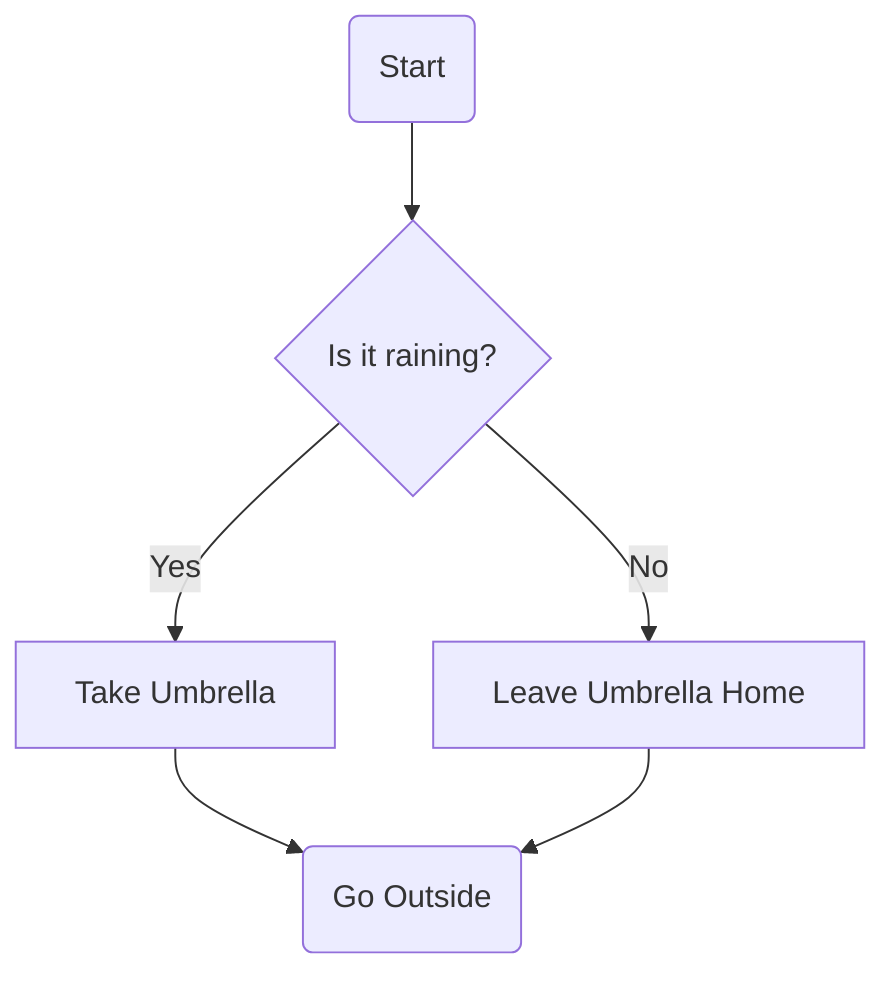

Some words for reading

This is now a blog post

```json
"key": "value"
```


```mermaid
graph TD
    A(Start) --> B{Is it raining?};
    B -- Yes --> C[Take Umbrella];
    B -- No --> D[Leave Umbrella Home];
    C --> E(Go Outside);
    D --> E;
```
